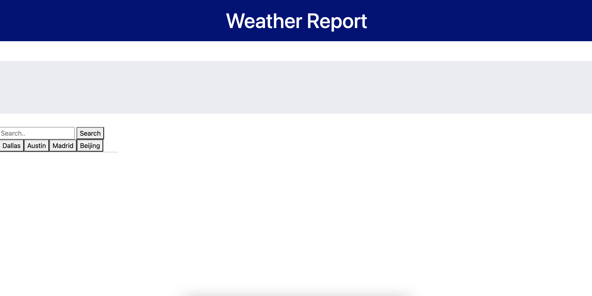
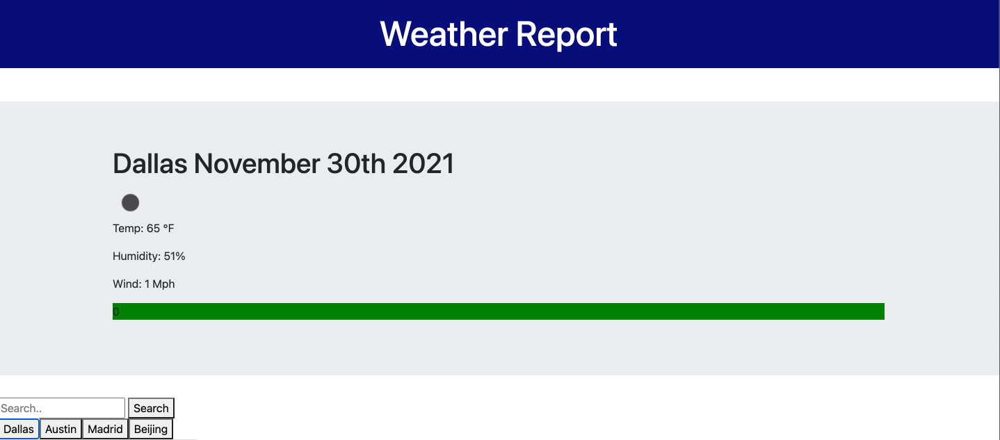
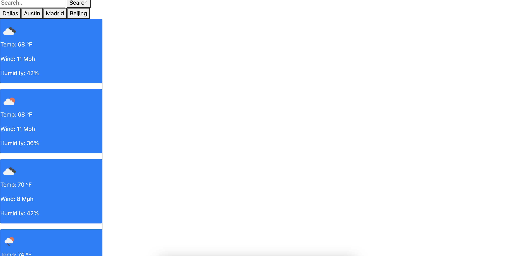

# 🏗️ Weather Dashboard

Link : https://caswellorr.github.io/Weather-Report/

## Description 📖

The Weather Dashboard application fetches data from an open weather API and displays it onto a dashboard. The user can search the weather for anywhere in the world.

The apllication displays current weather data and a five day forecast.

## Features 📝

Weather Dashboard uses JavaScript to fetch data from an opensourced API and populates a dashboard with selected data from the API. 

It uses localStorage to save the search history, and the user can reclick on a previously searched city. 

## Screenshots 📷 :

* User inputs a city into the search bar or click on a previously searched city:

  
  
* User receives information on current weather:

  

* User receives a five day forecast:

  
  

## Takeaways 💡

 I learned how to fetch data from an API and display pieces of the data onto a few elements on the web page.

 The page could be mopre visually pleasing; however, I am proud of its functionality.

----
© 2021 Caswell Orr. Confidential and Proprietary. All Rights Reserved.
